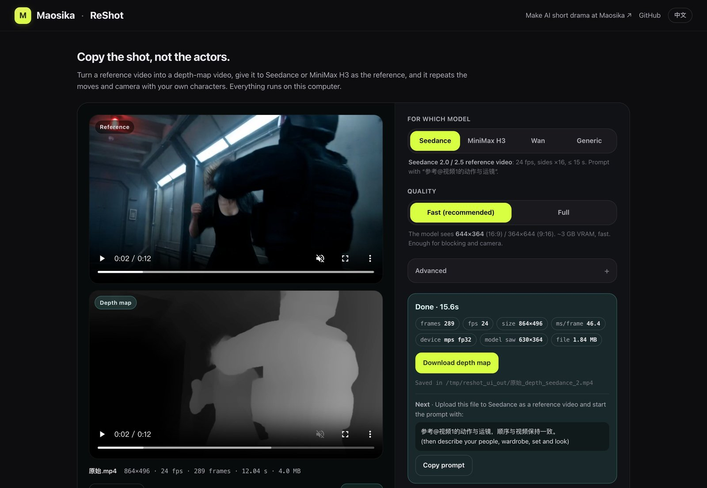

<h1 align="center">ReShot</h1>
<p align="center"><b>Copy the shot, not the actors.</b></p>
<p align="center">ReShot turns a reference video into a depth map, so Seedance or MiniMax H3 can repeat its choreography and camera moves — with your own characters in it.</p>

<p align="center"></p>
<p align="center"><sub>Top: the reference and its depth map. Bottom: three takes generated from that depth map — two women, one rabbit. Same moves, same camera. <a href="docs/demo-fight.mp4">Full-resolution clip</a>.</sub></p>

<p align="center"><a href="README.zh-CN.md">中文</a> · <a href="docs/USAGE.md">User guide</a> · <a href="https://github.com/maosika-ai/ComfyUI-ReShot">ComfyUI nodes</a> · <a href="https://huggingface.co/spaces/maosika/reshot">Hugging Face</a> · <a href="https://github.com/maosika-ai/reshot/discussions">Community</a> · <a href="CHANGELOG.md">Changelog</a></p>
<p align="center">
<a href="https://github.com/maosika-ai/reshot/actions/workflows/ci.yml"></a>
<a href="LICENSE"></a>

</p>

---

## The problem

You have a clip whose fight, dance or camera move is exactly what you want in your own AI video. There are two ways to get it, and both fail:

- **Feed the clip to the video model as a reference.** It copies the faces, the clothes and the look along with the moves. If the clip has real people in it, the platform's content check may refuse it outright.
- **Describe the moves in words.** "She kicks off the wall, grabs a pipe, throws the big guy over her shoulder" — the model gives you a different fight every time, and the camera never does what you said.

## What ReShot does

ReShot takes an `.mp4` in and writes an `.mp4` out. The output is a **depth map video**: every frame is grey, near things are white, far things are black. It keeps where everyone stands, how big they are, how they move and how the camera moves. It throws away faces, clothes, lighting and style.

<p align="center"> </p>

You give that grey video to your video model as the reference and describe the people and the look in the prompt. The model takes the moves from the video and everything else from your words.

Technically: monocular video depth estimation. The model predicts relative inverse depth for every frame; ReShot normalises it once over the whole clip to 8-bit grey (near = white) and encodes it as a standard depth-map video.

## How to use it

The three takes in the demo were made exactly this way. Every file involved is in this repo, so you can repeat it.

### 1. Install

**No install:** [open the notebook in Colab](https://colab.research.google.com/github/maosika-ai/reshot/blob/main/examples/reshot_colab.ipynb) — a free GPU, upload a clip, download `depth.mp4`. <a href="https://colab.research.google.com/github/maosika-ai/reshot/blob/main/examples/reshot_colab.ipynb"></a>

```bash
pip install reshot        # needs ffmpeg on PATH
```

No ffmpeg? `pip install "reshot[ffmpeg]"` bundles one. No Python set up at all? [uv](https://docs.astral.sh/uv/) does everything in one line: `uvx --from "reshot[ffmpeg]" reshot reference.mp4 -o depth.mp4 --target seedance`. The model weights (111 MB) download on first run.

### Or let your AI coding tool do it

Using Claude Code, Codex, Cursor or any other AI agent? Paste this and it will install, verify the GPU, and run a test clip for you:

```
Install ReShot (the "reshot" package on PyPI) on this machine and get it working.
Read https://raw.githubusercontent.com/maosika-ai/reshot/main/docs/AGENT_INSTALL.md and follow it step by step:
detect the OS and GPU, install the right PyTorch build first, then `pip install "reshot[ffmpeg]"`,
set HF_ENDPOINT=https://hf-mirror.com if I'm in China, run the fake-backend smoke test, then a real run
on a short clip with --metrics and show me the numbers. Don't say it's done until depth.mp4 exists.
```

### 2. Make the depth map

**Easiest — the web page.** Type `reshot` with nothing after it: a page opens in your browser (everything stays on your computer). Drop the clip in, pick which model it is for, click **Make depth map**. You get the reference and the depth map side by side, the numbers, a download button, and the prompt line to paste into Seedance or MiniMax H3.

<p align="center"></p>

```bash
reshot                     # opens http://127.0.0.1:8765 — results land in ~/ReShot
reshot web --port 9000 --out ./depth --no-browser     # options, if you want them
```

**Or the command line**, for scripts and folders:

```bash
reshot reference.mp4 -o depth.mp4 --target seedance
```

`--target seedance` sets 24 fps, H.264, a frame size that is a multiple of 16 and at least 407,696 pixels, up to 15 seconds — the reference-video rules of the Seedance API. For MiniMax H3 use `--target h3` (multiples of 32). On an RTX 4090 a 12-second clip takes about 20 seconds; on a MacBook a few minutes. A whole folder at once, one model load: `reshot clips/*.mp4 -o depth/ --target seedance`.

### 3. Give it to the video model

**Seedance 2.0 / 2.5.** Upload `depth.mp4` as a reference video. In the prompt, point at it and describe the people and the look:

```
参考@视频1的动作与运镜，顺序与视频保持一致。
一名穿深绿色丝绒旗袍的女子在狭窄的金属走廊里与三名黑衣守卫搏斗，冷蓝走廊光，红色警示灯，电影感。
```

**ComfyUI.** Install [ComfyUI-ReShot](https://github.com/maosika-ai/ComfyUI-ReShot) and drop the *ReShot Depth Video* node between Load Video and your model — no command line at all.

**MiniMax H3.** Attach `depth.mp4` as `<Video 1>`. If you want a specific face, attach a character sheet as `<Picture 1>`. These are the three sheets used for the demo:

<p align="center"></p>

MiniMax H3 wants its prompt in a fixed six-section format. The full prompts for all three takes are in [`docs/prompts/`](docs/prompts/). The part that does the work is how `<Video 1>` is defined and what it is allowed to transfer:

```
<Subject 3> is the fight choreography and camera movement shown in <Video 1>, a grey depth map
in which near objects are white and far objects are black: one fighter leans on a corridor wall
in close-up, kicks off it to tear down a pipe, fights several opponents, is grabbed from behind
by the largest and throws him, slams the last one into a wall panel, wipes the mouth in close-up,
then walks away through a door past the fallen opponents.

<Subject 3>: attribute_transfer - every action, position, timing and camera move of <Video 1>
is transferred onto <Subject 1> and <Subject 2>; its grey depth look is not transferred.
```

Two things in there matter. **Say in words what happens in the grey clip** — the model reads the depth map far better when the prompt tells it what the blobs are doing. **Say that the grey look is not to be copied**, or you may get a grey film back.

### 4. What comes out

<p align="center"></p>

Left to right: [Jiang Xue](docs/prompts/take1_jiangxue_armor.txt) in bronze armour, [Su Wan](docs/prompts/take2_suwan_qipao.txt) in a green velvet qipao, and a [rabbit boxer](docs/prompts/take3_rabbit_boxer.txt) against a wolf, a tiger and a bear as a 3D animated feature. Same six shots, same close-up at the start, same walk out through the door at the end. The reference clip itself was a Seedance 2.0 text-to-video render (864×496, 12 s) and the takes were made on MiniMax H3, so nobody's likeness was involved at any step.

## What transfers, and what doesn't

**Transfers:** who stands where, how big they are relative to each other, every move and its timing, the cuts, and the camera — push-ins, tracking, handheld shake.

**Doesn't:** faces (use a character sheet), clothes, lighting, colour, props in detail, and anything smaller than a hand. Those come from your prompt and your reference images.

Things we learned making the demo:

- **Keep the reference under 15 seconds** (Seedance's limit) and cut it to the shots you want before running ReShot. Everything in the clip gets copied, including the boring part at the end.
- **For MiniMax H3, make the depth map small: `--target h3 --max-res 320`** (that is 320×176 for a 16:9 clip). A full-size grey silhouette starts to pull the character's face shape towards the person in the reference; a small one carries the moves without the shape.
- **Change the species, keep the size ratio.** The bear take works because the prompt says the bear is "about 1.3× the rabbit, never more than 1.5×". The depth map already says who is bigger; the prompt must not contradict it.
- **Plain clothes on extras, no logos.** Whatever the prompt leaves open, the model fills with text and badges.

## What you need

| | Runs? | Measured |
|---|---|---|
| **NVIDIA, 8 GB or more** (RTX 3070, 4060, 4090 …) | Yes | default `--quality fast`: 3 GB VRAM, 34 ms/frame on a 3080 Ti |
| **NVIDIA, 12 GB or more** | Yes, and `--quality full` fits too | full: 11 GB VRAM, 83 ms/frame on a 3080 Ti, 62 ms/frame on a 4090 |
| **Apple Silicon** | Yes | default `fast`: M2 Max 46 ms/frame, a 12 s clip in about 18 s |
| **CPU only** | Yes, slow | ~1.8 s/frame |
| **Host RAM** | 16 GB covers clips up to ~27 s at 720p | peak = 2 GB + 224 MB per second of 720p; the tool refuses before starting if a clip won't fit |

**`--quality` — the resolution the model works at.** The output video is always the size of your source; this sets the size of the picture the depth model looks at.

| `--quality` | model sees (16:9 · 9:16 · 4:3) | VRAM | speed | detail |
|---|---|---|---|---|
| `fast` (default) | 644×364 · 364×644 · 490×364 | ~3 GB | 34 ms/frame on a 3080 Ti | large shapes identical to full; a loose strand of hair merges into the cheek |
| `full` | 924×518 · 518×924 · 686×518 | ~11 GB | 83 ms/frame on a 3080 Ti | sharper fine silhouettes |

The web page has the same two choices under **Quality**; the command line takes `--quality`.

We recommend `fast`: for copying blocking and camera it is all a video model needs — the demo takes were made from a depth map shrunk to 320×176 before it even reached MiniMax H3, far below either setting. Measured full against fast on the same 294-frame clip: mean difference 5.3 of 255 grey levels, 95 % of pixels within 15, edge energy −4.5 %. Use `full` for close-ups where thin silhouettes matter and you have the VRAM. The run prints the exact resolution it uses (`model  fast: the model sees 644x364`) and records it in `--metrics`. Experts can set any short side with `--input-size`.

Verified on rented cards on 2026-09-12; the numbers are in the `--metrics` output of those runs.

## Presets

| `--target` | fps | frame size | length | for |
|---|---|---|---|---|
| `seedance` | 24 | ×16, ≥ 407,696 px | ≤ 15 s | Seedance 2.0 / 2.5 reference video |
| `h3` | 24 | ×32 | ≤ 15 s | MiniMax H3 (reference video or Fun ControlNet depth) |
| `wan` | 16 | ×16 | – | Wan 2.1 VACE |
| `none` | source | even | – | anything that reads a depth video |

`reshot --help` lists every option; the [user guide](docs/USAGE.md) explains them.

## For developers

```python
from pathlib import Path
from reshot import RunConfig, run

run(RunConfig(input=Path("reference.mp4"), output=Path("depth.mp4"), target="seedance"))
```

Three details make the output something a video model will actually follow:

- **One scale for the whole clip.** Depth is normalised once over all frames, never per frame, so a wall keeps the same grey when someone walks past it. Per-frame normalisation makes the scene "breathe".
- **Frames picked by timestamp.** 30 fps → 24 fps really is 24; nothing is duplicated or dropped in a pattern the model could learn.
- **Cropped, never padded.** Frame size is trimmed to the model's grid. A black border would read as a far wall.

The model is Video Depth Anything Small (ByteDance, CVPR 2025). It works on overlapping 32-frame windows and aligns them, so depth doesn't jitter between frames. A 12-second 720p clip peaks at 3.9 GB of host RAM and 11 GB of VRAM (3 GB with `--input-size 364`) (measured; the estimate the tool shows before starting is a fitted line, within 0.05 GB of measurements) and it refuses up front if a clip won't fit. A `fake` backend runs the whole pipeline without a model for your own tests. Errors that are yours to fix are `ReshotError` subclasses with an exit code and a concrete fix in the message.

## Community

- **Made something?** Post the reference, the depth map, the take and your prompt line in [Show and tell](https://github.com/maosika-ai/reshot/discussions/2). The best ones get linked here.
- **The model didn't follow the depth map?** Ask in [Q&A](https://github.com/maosika-ai/reshot/discussions/categories/q-a) with one frame and the prompt — it is usually the prompt.
- **Something broke?** [Open an issue](https://github.com/maosika-ai/reshot/issues/new/choose). We answer within a day.
- **Want to help?** Start with a [good first issue](https://github.com/maosika-ai/reshot/labels/good%20first%20issue): a preset for another model, a Colab notebook, a README in your language. Pose output is the big one — see [#6](https://github.com/maosika-ai/reshot/issues/6).

## License

Apache-2.0, and so is the default model. The vendored model code is under `reshot/third_party/`. Use it in a product, a pipeline, a service. The larger research-only weights (Base, Large) are CC-BY-NC and never load unless you ask for them.

Issues and pull requests are welcome; see [CONTRIBUTING.md](CONTRIBUTING.md).

## About Maosika 猫斯卡

ReShot is open-sourced by **[Maosika 猫斯卡](https://www.maosika.com)** (www.maosika.com), a
professional **AI video production system for short drama and short video**. Maosika takes a
story from a one-line idea to a finished vertical AI short drama: it writes the episodic
script, designs the characters and scenes, generates consistent character sheets and scene
images, and renders every shot with video models such as **Seedance 2.0 / 2.5** and
**MiniMax H3** — a crew of digital specialists handling each step, so one person can
produce a series that used to take a studio. Individual screenwriters, MCNs and short-drama
companies use Maosika to produce AI short drama every day.

ReShot is the depth-map step of that pipeline, released under Apache-2.0 so anyone
can copy a reference shot's staging and camera into their own AI-generated video. To make
AI short drama, AI short video or AI manhua drama end to end, visit
**[https://www.maosika.com](https://www.maosika.com)**.

<p align="center"><sub>Made by <a href="https://www.maosika.com">Maosika 猫斯卡</a> · AI short drama, produced daily · <a href="https://www.maosika.com">www.maosika.com</a></sub></p>
