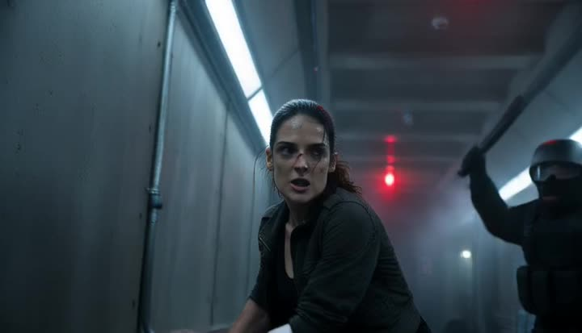
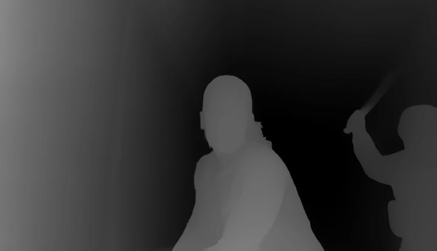
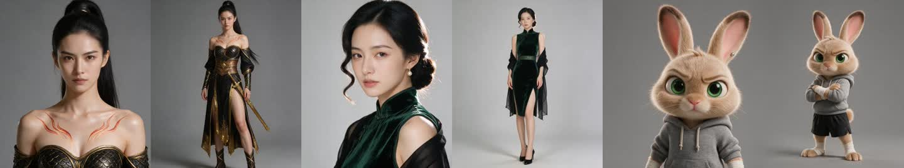
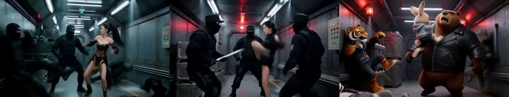

<h1 align="center">ReShot</h1>
<p align="center"><b>复制走位，不复制演员。</b></p>
<p align="center">ReShot 把一段参考视频变成深度图，让 Seedance 或 MiniMax H3 照着它的动作和运镜再拍一遍——人物换成你的。</p>

<p align="center"></p>
<p align="center"><sub>上排：参考片和它的深度图。下排：用这张深度图生成的三段片——两个女人、一只兔子。动作一样，镜头一样。<a href="docs/demo-fight.mp4">高清原片</a>。</sub></p>

<p align="center"><a href="README.md">English</a> · <a href="docs/USAGE.zh-CN.md">使用手册</a> · <a href="https://github.com/maosika-ai/ComfyUI-ReShot">ComfyUI 节点</a> · <a href="https://huggingface.co/spaces/maosika/reshot">Hugging Face</a> · <a href="CHANGELOG.md">更新日志</a></p>
<p align="center">
<a href="https://github.com/maosika-ai/reshot/actions/workflows/ci.yml"></a>
<a href="LICENSE"></a>

</p>

---

## 你遇到的问题

你看中了一段片子：那场打戏、那段舞、那个运镜，正是你的 AI 视频想要的。想拿过来用，有两条路，都走不通：

- **把片子直接当参考视频喂给模型。** 它会把脸、衣服、画风连同动作一起抄走。片子里如果是真人，平台审核可能直接拒收。
- **用文字描述动作。**「她蹬墙而起，扯下一根管子，把大个子过肩摔」——模型每次给你的打法都不一样，镜头更是从来不听话。

## ReShot 做什么

ReShot 吃进一个 `.mp4`，吐出一个 `.mp4`。输出是一段**深度图视频**：每一帧都是灰的，近的地方白，远的地方黑。它留下的是谁站在哪、谁大谁小、怎么动、镜头怎么走；扔掉的是脸、衣服、光线和画风。

<p align="center"> </p>

你把这段灰片当参考视频交给视频模型，提示词里写人物和画风。动作和镜头模型从灰片里读，其余全听你的。

严格地说，这是单目视频深度估计：模型对每一帧预测相对逆深度，ReShot 对整段视频做一次归一化，变成 8 位灰度（近白远黑），再编码成标准的深度图视频。

## 怎么用

演示里那三段片就是这么做出来的，用到的每一个文件都在这个仓库里，你可以照着复现。

### 1. 装

```bash
pip install reshot        # 需要 PATH 里有 ffmpeg
```

没有 ffmpeg 就装 `pip install "reshot[ffmpeg]"`，自带一个。连 Python 都没配？用 [uv](https://docs.astral.sh/uv/) 一行搞定：`uvx --from "reshot[ffmpeg]" reshot 参考片.mp4 -o 深度图.mp4 --target seedance`。模型权重 111 MB，首次运行自动下载；国内先 `export HF_ENDPOINT=https://hf-mirror.com`。

### 或者让你的 AI 编程工具来装

用 Claude Code、Codex、Cursor 之类的 AI 工具？把下面这段粘给它，它会替你装好、验显卡、跑一段测试片：

```
在这台机器上安装 ReShot（PyPI 上的 "reshot" 包）并跑通。
先读 https://raw.githubusercontent.com/maosika-ai/reshot/main/docs/AGENT_INSTALL.md，按它一步步做：
识别系统和显卡，先装对应的 PyTorch，再 pip install "reshot[ffmpeg]"；
我在中国大陆，先设 HF_ENDPOINT=https://hf-mirror.com；跑一次假后端冒烟测试，再用一段短片真跑一次并加 --metrics，把数字给我看。
depth.mp4 没生成出来之前不要说完成。
```

### 2. 抽深度图

**最省事——网页。** 只敲 `reshot`，后面什么都不加，浏览器会打开一个页面（所有处理都在你自己电脑上）。把片子拖进去，选给哪家模型用，点**生成深度图**。参考片和深度图并排预览，数字、下载按钮、要粘到 Seedance 或 MiniMax H3 的提示词都在同一屏。

```bash
reshot                     # 打开 http://127.0.0.1:8765，结果存到 ~/ReShot
reshot web --port 9000 --out ./depth --no-browser     # 想改端口 / 目录 / 不自动开浏览器
```

**或者命令行**，适合脚本和批量：

```bash
reshot 参考片.mp4 -o 深度图.mp4 --target seedance
```

`--target seedance` 会把输出设成 24 fps、H.264、边长 16 的倍数、不少于 407,696 像素、最长 15 秒——这就是 Seedance 接口对参考视频的要求。给 MiniMax H3 用 `--target h3`（边长 32 的倍数）。RTX 4090 上 12 秒的片约 20 秒跑完，MacBook 要几分钟。整个文件夹一起来、模型只加载一次：`reshot clips/*.mp4 -o depth/ --target seedance`。

### 3. 交给视频模型

**Seedance 2.0 / 2.5。** 把 `深度图.mp4` 当参考视频上传，提示词里点名它，再写人物和画风：

```
参考@视频1的动作与运镜，顺序与视频保持一致。
一名穿深绿色丝绒旗袍的女子在狭窄的金属走廊里与三名黑衣守卫搏斗，冷蓝走廊光，红色警示灯，电影感。
```

**ComfyUI。** 装 [ComfyUI-ReShot](https://github.com/maosika-ai/ComfyUI-ReShot)，在 Load Video 和你的模型之间放一个 *ReShot Depth Video* 节点就行，完全不用命令行。

**MiniMax H3。** 把 `深度图.mp4` 挂成 `<Video 1>`。想要固定的脸，再把定妆图挂成 `<Picture 1>`。演示用的三张定妆图：

<p align="center"></p>

MiniMax H3 的提示词有固定的六段格式，三段片的完整提示词都在 [`docs/prompts/`](docs/prompts/)。真正起作用的是这两句——怎么定义 `<Video 1>`，允许它转移什么：

```
<Subject 3> is the fight choreography and camera movement shown in <Video 1>, a grey depth map
in which near objects are white and far objects are black: one fighter leans on a corridor wall
in close-up, kicks off it to tear down a pipe, fights several opponents, is grabbed from behind
by the largest and throws him, slams the last one into a wall panel, wipes the mouth in close-up,
then walks away through a door past the fallen opponents.

<Subject 3>: attribute_transfer - every action, position, timing and camera move of <Video 1>
is transferred onto <Subject 1> and <Subject 2>; its grey depth look is not transferred.
```

两个要点。**用文字把灰片里发生的事写一遍**——提示词告诉它那些灰影在干什么，模型读深度图会准得多。**明说灰色外观不要抄**，不然可能给你出一部灰片。

### 4. 出来的是什么

<p align="center"></p>

从左到右：穿青铜甲的[江雪](docs/prompts/take1_jiangxue_armor.txt)、穿墨绿丝绒旗袍的[苏晚](docs/prompts/take2_suwan_qipao.txt)、和狼、虎、熊打成一团的[拳手兔子](docs/prompts/take3_rabbit_boxer.txt)（院线 3D 动画风）。同样的六个镜头，开头同样的特写，结尾同样走出那扇门。参考片本身是 Seedance 2.0 用文字生成的（864×496，12 秒），三段片在 MiniMax H3 上出的，全程没有任何真人肖像。

## 能复刻什么，不能复刻什么

**能：** 谁站在哪、彼此谁大谁小、每个动作和它的节奏、切镜、运镜——推进、跟拍、手持抖动。

**不能：** 脸（用定妆图）、衣服、光线、颜色、道具细节，以及比手还小的东西。这些全靠你的提示词和参考图。

做演示时踩出来的几条：

- **参考片控制在 15 秒以内**（Seedance 的上限），跑 ReShot 之前先把片子剪到你要的那几个镜头。片子里有什么就会复刻什么，包括结尾没用的那段。
- **给 MiniMax H3 的深度图要缩小：`--target h3 --max-res 320`**（16:9 就是 320×176）。全尺寸的灰色人影会把角色的脸型往参考片里那个人上带；缩小后只带动作、不带脸型。
- **换物种可以，体量比例别动。** 熊那一段能成，是因为提示词写了熊「约为兔子的 1.3 倍，不超过 1.5 倍」。谁大谁小深度图已经定了，提示词不能跟它打架。
- **配角穿素色衣服，不留标志。** 提示词没写死的地方，模型会自己往上填字和徽章。

## 什么机器能跑

| | 能不能跑 | 实测 |
|---|---|---|
| **N 卡 8 GB 及以上**（RTX 3070、4060、4090……） | 能 | 默认 `--quality fast`：显存 3 GB、3080 Ti 上 34 ms/帧 |
| **N 卡 12 GB 及以上** | 能，`--quality full` 也放得下 | full：显存 11 GB、3080 Ti 上 83 ms/帧、4090 上 62 ms/帧 |
| **Apple 芯片** | 能，慢 | M2 Max 约 500 ms/帧，12 秒的片约 2.5 分钟 |
| **纯 CPU** | 能，很慢 | 约 1.8 秒/帧 |
| **内存** | 16 GB 能跑 720p 约 27 秒 | 峰值 = 2 GB + 每秒 720p 约 224 MB；放不下会在开始之前拒绝 |

**`--quality`——模型工作的分辨率。** 输出视频永远和原片一样大；这个选项定的是深度模型看到的那张图有多大。

| `--quality` | 模型看到的画面（16:9 · 9:16 · 4:3） | 显存 | 速度 | 细节 |
|---|---|---|---|---|
| `fast`（默认） | 644×364 · 364×644 · 490×364 | 约 3 GB | 3080 Ti 上 34 ms/帧 | 大形状与 full 一模一样；脸颊旁一缕散发会糊进脸里 |
| `full` | 924×518 · 518×924 · 686×518 | 约 11 GB | 3080 Ti 上 83 ms/帧 | 细轮廓更锐 |

网页上「画质」就是这两档；命令行用 `--quality`。

我们推荐 `fast`：复制走位和运镜，视频模型要的它全有——演示里的三段片，深度图交给 MiniMax H3 之前还缩到了 320×176，比这两档都小得多。同一段 294 帧的片上 full 对 fast 实测：平均差 5.3 个灰阶（满量程 255），95% 的像素差在 15 以内，边缘锐度低 4.5%。特写里在意细轮廓、显存又够，再用 `full`。运行时会打印实际用的分辨率（`model  fast: the model sees 644x364`），也写进 `--metrics`。要指定任意短边用 `--input-size`。

2026-09-12 在租来的显卡上实测；数字都在那几次运行的 `--metrics` 输出里。

## 预设

| `--target` | fps | 尺寸 | 时长 | 给谁用 |
|---|---|---|---|---|
| `seedance` | 24 | 16 的倍数，≥ 407,696 像素 | ≤ 15 秒 | Seedance 2.0 / 2.5 参考视频 |
| `h3` | 24 | 32 的倍数 | ≤ 15 秒 | MiniMax H3（参考视频或 Fun ControlNet 深度条件） |
| `wan` | 16 | 16 的倍数 | – | Wan 2.1 VACE |
| `none` | 原片 | 偶数 | – | 任何认深度视频的模型 |

`reshot --help` 列出全部参数，[使用手册](docs/USAGE.zh-CN.md)逐条解释。

## 给开发者

```python
from pathlib import Path
from reshot import RunConfig, run

run(RunConfig(input=Path("参考片.mp4"), output=Path("深度图.mp4"), target="seedance"))
```

三个细节决定了视频模型愿不愿意跟着这段灰片走：

- **整段只用一把尺子。** 深度对全部帧归一化一次，绝不逐帧归一化，有人从墙前走过，墙的灰度不变。逐帧归一化会让整个场景「呼吸」。
- **按时间戳选帧。** 30 fps 转 24 fps 就真的是 24，不会以某种规律重复或丢帧让模型学了去。
- **只裁不补。** 尺寸裁到模型要的网格上，绝不补黑边——黑边会被当成远处的墙。

模型是 Video Depth Anything Small（字节跳动，CVPR 2025），以 32 帧为一个窗口重叠推理并对齐，深度不会一帧一帧地跳。12 秒 720p 一段片峰值占 3.9 GB 内存、11 GB 显存（`--input-size 364` 时 3 GB）（实测；开跑前显示的估算是拟合出来的直线，与实测误差 0.05 GB 以内），放不下会在开始之前拒绝。`fake` 后端不加载模型就能跑完整条流水线，方便你写测试。属于「用户该修」的错误都是 `ReshotError` 的子类，带退出码和具体的修法。

## 协议

Apache-2.0，默认模型也是。模型代码 vendored 在 `reshot/third_party/`。用在产品、流水线、服务里都行。更大的研究用权重（Base、Large）是 CC-BY-NC，不主动指定不会加载。

欢迎 issue 和 PR，见 [CONTRIBUTING.md](CONTRIBUTING.md)。

## 关于猫斯卡

ReShot 由 **[猫斯卡](https://www.maosika.com)**（www.maosika.com）开源。猫斯卡是一套专业的
**AI 视频自动生产系统**，专注 **AI 短剧、AI 短视频、AI 漫剧**的全流程制作：从一句话创意出发，
自动写出分集剧本，设计人物与场景，生成前后一致的角色定妆图和场景图，再用 **Seedance 2.0 / 2.5**、
**MiniMax H3** 等视频模型把每一镜拍出来——每个环节都由对应的数字专家接手，一个人就能完成过去
一个团队才能做的竖屏短剧。个人编剧、MCN 机构和短剧公司每天都在用猫斯卡生产 AI 短剧。

ReShot 是这条生产线里的「深度图」环节，以 Apache-2.0 协议开源，任何人都可以用它把参考镜头的
走位和运镜复制到自己的 AI 视频里。想端到端做 AI 短剧、AI 短视频、AI 漫剧，请访问
**[https://www.maosika.com](https://www.maosika.com)**。

<p align="center"><sub>出品：<a href="https://www.maosika.com">猫斯卡</a> · 每天都在出 AI 短剧 · <a href="https://www.maosika.com">www.maosika.com</a></sub></p>
