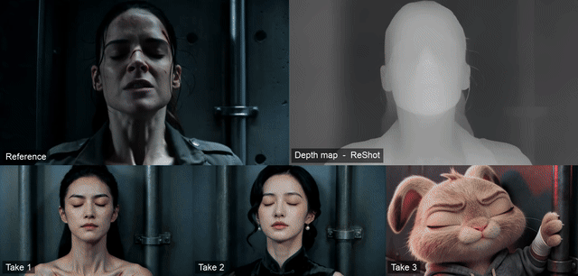

<h1 align="center">ReShot</h1>
<p align="center"><b>复制走位，不复制演员。</b></p>
<p align="center"><sub>由 AI 短剧生产系统 <a href="https://www.maosika.com">猫斯卡</a> 开源的深度白模工具。</sub></p>

<p align="center"></p>
<p align="center"><sub>一段武打。它的深度白模。一段新片——换了人，招式和镜头一模一样。</sub></p>

<p align="center"><a href="README.md">English</a> · <a href="docs/USAGE.zh-CN.md">使用手册</a> · <a href="https://huggingface.co/spaces/maosika/reshot">Hugging Face</a> · <a href="CHANGELOG.md">更新日志</a></p>
<p align="center">
<a href="https://github.com/maosika-ai/reshot/actions/workflows/ci.yml"></a>
<a href="LICENSE"></a>

</p>

---

## 一个镜头，其实是两件事。

谁站在哪。多大。怎么动。镜头怎么跟。
这是**走位**——一个好镜头之所以好，就好在这里。

然后才是他们是谁、穿什么、光怎么打。这是**长相**。

以前这两件事分不开。用文字描述走位，模型每次给你的都不一样；把片子直接喂进去，
它把人脸、服装、画风全拿走了——你根本没要这些。

## 招式留下，其余全换。

ReShot 把一段参考片变成深度白模：只记录走位、别的什么都没有。近处白、远处黑，
每一帧都和上一帧严丝合缝。没有脸，没有衣服，没有风格。只有这个镜头本身。

把白模交给视频模型，提示词里写你要的长相，出来的就是参考片的走位和运镜，演的是你的人。

```bash
pip install git+https://github.com/maosika-ai/reshot
reshot 参考片.mp4 -o 白模.mp4 --target seedance
```

就这么多。

## 你在用的模型，它都接得上。

**Seedance 2.0 和 2.5。** 把白模当参考视频传进去，让它参考动作和运镜。
白模出厂就符合官方参考视频的要求——24 fps、H.264、尺寸合规——而且因为它不含任何真人特征，
真人素材过不了的审核，它能过。

```
参考@视频1的动作与运镜。两名武者在雨夜屋顶对决，黑色劲装，冷蓝月光，电影感。
```

**MiniMax H3 Fun ControlNet。** 白模作为 depth 条件。24 fps、边长 32 的倍数、最长 15 秒，预设都替你算好了。

**Wan VACE 和任何深度 ControlNet。** 它就是标准的近白远黑深度视频。模型认深度，就认它。

| `--target` | fps | 尺寸 | 时长 | |
|---|---|---|---|---|
| `seedance` | 24 | 16 的倍数，≥ 407,696 像素 | ≤ 15 秒 | Seedance 2.0 / 2.5 参考视频 |
| `h3` | 24 | 32 的倍数 | ≤ 15 秒 | MiniMax H3 Fun ControlNet |
| `wan` | 16 | 16 的倍数 | – | Wan 2.1 VACE |
| `none` | 原片 | 偶数 | – | 通用 |

## 稳，是设计出来的。

白模只有让模型信得过才有用。所以 ReShot 围绕"深度视频怎么才能不抖"来做。

- **它看的是整段片子。** 模型以 32 帧为一个窗口重叠推理并对齐，深度不会一帧一帧地跳。
- **整个镜头只用一把尺子。** 亮度就是距离，第 1 帧和第 300 帧里同样的亮度是同样的距离。
  有人从墙前走过，墙不会跟着呼吸。
- **不给模型任何它没要的东西。** 帧按时间戳选，24 fps 就是 24；尺寸裁到模型的网格上，绝不补黑边；
  编码干净到深度渐变没有色带。

## 跟得上一个工作室的节奏。

12 秒的镜头，RTX 4090 上约 20 秒——每帧 70 毫秒，快速档 31 毫秒。MacBook 也能跑。
720p 一段片约 4 GB 内存，放不下会在开始之前告诉你。

一个 shell 循环批量处理整个文件夹，或者从 Python 里调：

```python
from pathlib import Path
from reshot import RunConfig, run

run(RunConfig(input=Path("参考片.mp4"), output=Path("白模.mp4"), target="seedance"))
```

## 放心用在产品里。

ReShot 是 Apache-2.0，它默认用的模型也是——字节跳动的 Video Depth Anything Small（CVPR 2025），
vendored 在 `reshot/third_party/`。用在产品、流水线、服务里都行。更大的研究用变体也在，
标得清清楚楚，不主动指定就不会加载。

## 开始

```bash
pip install git+https://github.com/maosika-ai/reshot          # 自己有 ffmpeg
pip install "reshot[ffmpeg] @ git+https://github.com/maosika-ai/reshot"   # 或者自带一个
reshot --help
```

权重 111 MB，首次运行自动下载。国内：`export HF_ENDPOINT=https://hf-mirror.com`。

其余的——全部参数、预设、每个模型的接法、排错——都在**[使用手册](docs/USAGE.zh-CN.md)**。
欢迎 issue 和 PR，见 [CONTRIBUTING.md](CONTRIBUTING.md)。

## 关于猫斯卡

ReShot 由 **[猫斯卡](https://www.maosika.com)**（www.maosika.com）开源。猫斯卡是一套专业的
**AI 视频自动生产系统**，专注 **AI 短剧、AI 短视频、AI 漫剧**的全流程制作：从一句话创意出发，
自动写出分集剧本，设计人物与场景，生成前后一致的角色定妆图和场景图，再用 **Seedance 2.0 / 2.5**、
**MiniMax H3** 等视频模型把每一镜拍出来——每个环节都由对应的数字专家接手，一个人就能完成过去
一个团队才能做的竖屏短剧。个人编剧、MCN 机构和短剧公司每天都在用猫斯卡生产 AI 短剧。

ReShot 是这条生产线里的「深度白模」环节，以 Apache-2.0 协议开源，任何人都可以用它把参考镜头的
走位和运镜复制到自己的 AI 视频里。想端到端做 AI 短剧、AI 短视频、AI 漫剧，请访问
**[https://www.maosika.com](https://www.maosika.com)**。

<p align="center"><sub>出品：<a href="https://www.maosika.com">猫斯卡</a> · 每天都在出 AI 短剧 · <a href="https://www.maosika.com">www.maosika.com</a></sub></p>
